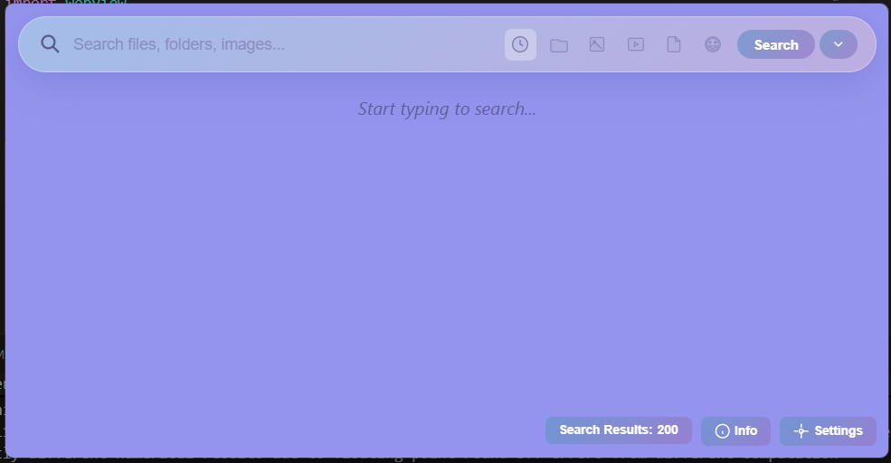
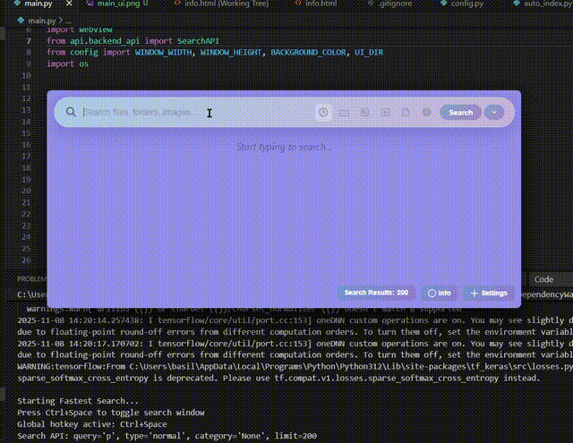

# Smart Search

<div align="center">



[](https://www.python.org/downloads/)
[](#license)
[](https://github.com/basilbenny1002/Smart-Search)

**A fast file search tool using SQLite-based indexing and AI-powered semantic search.**

Currently in beta - actively being improved with updates and new features!

[Features](#features) • [Installation](#installation) • [Usage](#usage) • [Auto-Indexing](#auto-indexing-optional) • [Contributing](#contributing) • [Contact](#contact)

</div>

---

## Demo



## Features

- **Fast File Search** - SQLite-based indexing for quick file and folder searches
- **AI Image Search** - Search images by their content using AI-generated descriptions
- **Document Content Search** - Search within text files, PDFs, and documents
- **Smart Filters** - Filter by file type (folders, images, videos, documents, etc.)

## Installation

### Prerequisites

- **Python 3.12 or higher**
- **Git** (to clone the repository)
- **.NET SDK 6.0+** (Optional - only needed for auto-indexing feature)

### Quick Start

1. **Clone the repository**
   ```bash
   git clone https://github.com/basilbenny1002/Smart-Search.git
   cd Smart-Search
   ```

2. **Install dependencies**
   ```bash
   pip install -r requirements.txt
   ```

3. **Run the application**
   ```bash
   python main.py
   ```

That's it! The application will start and the search window will appear.

## Usage

### Initial Setup

When you first launch the app, you'll need to index your files before you can search. Here's how:

1. **Launch the app** - Run `python main.py`
2. **Open Settings** - Click the settings icon in the search window
3. **Index your files** - This step is required for the search to work:

   #### Index Files & Folders
   - Click the **"Index Files"** button
   - This will scan your system and create a searchable database
   - Note: This may take a while depending on how many files you have

   #### Index Images (Optional)
   - Click the **"Index Images"** button
   - Choose which folders to include (like Pictures, Documents, Desktop)
   - The tool will walk through all subdirectories and generate AI descriptions for your images
   - Note: This takes longer since it analyzes each image individually

   #### Index Documents (Optional)
   - Click the **"Index Documents"** button
   - Select the folders containing text files, PDFs, Word documents, etc.
   - The tool will index the content so you can search inside your documents
   - Note: Time varies based on the number and size of documents

4. **Start searching!** - Go back to the search window and type your query

### Search Types

You can choose different search modes from the dropdown menu next to the search button:

- **Normal Search** - Search files and folders by name (default mode)
- **Image Search** - Find images by describing their content (e.g., "sunset beach")
- **Text Search** - Search within document contents

## Auto-Indexing (Optional)

If you want to keep your search database up-to-date automatically, you can enable auto-indexing. This feature monitors your system for new files and indexes them automatically.

### Requirements
- **.NET SDK 6.0 or later** - [Download here](https://dotnet.microsoft.com/download)

### How It Works
1. Go to **Settings** and find the **Automation** section
2. Toggle **"Auto-Index New Files"** to ON
3. The app will:
   - Compile a C# file watcher executable
   - Add it to your Windows Startup folder
   - Monitor your system for new files and automatically index them

### What It Does
- Watches all your drives for new file creation
- Automatically indexes new files, images, and documents
- Runs silently in the background
- Starts automatically when Windows boots

### Disable Auto-Indexing
Simply toggle the switch to OFF in Settings. This will remove the watcher from Startup and stop the background process.

**Note:** Auto-indexing is completely optional. You can always just index files manually whenever you want!

## Project Structure

```
Smart-Search/
├── api/                # Backend API and search logic
├── assets/             # UI screenshots and demos
├── data/               # Indexed data and databases
├── indexing/           # File, image, and document indexers
├── models/             # Data models
├── scripts/            # C# file watcher for auto-indexing
├── search/             # Search algorithms
├── ui/                 # HTML/CSS/JS frontend
├── utils/              # Helper utilities
├── config.py           # Configuration settings
├── main.py             # Main entry point
└── requirements.txt    # Python dependencies
```

## Contributing

This project is in active beta development. There's plenty of room for improvement, and I'd love to hear your suggestions!

### How to Contribute
1. Fork the repository
2. Create a feature branch (`git checkout -b feature/amazing-feature`)
3. Commit your changes (`git commit -m 'Add amazing feature'`)
4. Push to the branch (`git push origin feature/amazing-feature`)
5. Open a Pull Request

### Feedback
Feel free to share your ideas and suggestions! Open an issue or contact me directly.

## Contact

**Basil Benny**

- Email: [basilbenny1002@gmail.com](mailto:basilbenny1002@gmail.com)
- LinkedIn: [basil-benny12](https://www.linkedin.com/in/basil-benny12/)
- Instagram: [@basil_benny12](https://www.instagram.com/basil_benny12)
- GitHub: [@basilbenny1002](https://github.com/basilbenny1002)

For help, support, or questions, feel free to reach out on any of these platforms.

## Resources

- **Learn How It Works:** [Medium Article](https://medium.com/@basilbenny1002/from-trees-to-sqlite-my-journey-building-a-smarter-search-for-windows-d85d77275c68)

## License

This project is licensed under the MIT License. See the [LICENSE](LICENSE) file for details.

---

<div align="center">

Star this repo if you find it useful!

</div>
